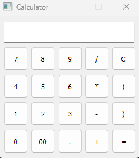

## About
- PyQt is a binding for Qt, which is a set of C++ libraries and development tools that can include platform independent abstractions for GUI.
- PyQt API does not follow PEP8
- PyQt Uses CamelCase for Functions, Methods and Variables

#### Basics of PyQt
- Widgets  
Rectangular Graphical Components. Attributes and Methods Used to Tweak Appearance and Behavior. Detects Events from User, Window System and Other Sources. Eg Buttons, labels, radio buttons, QCombo box
- Layout Managers 
classes to Size and Position Widgets. 
1. QHBoxLayout:
| . | . | . |  -> Horizontal Layout
2. QVBoxLayout: 
| . | 
| . |  -> Vertical Layout  
| . |

3. QGridLayout : Arrangemnt in Grid  
| . | . |  
| . | . |
4. QFormLayout
- Dialogs  
Applicaton types -> Main Widow Style Application and Dialog Style Application (Inherits from QDialog)
- Main Windows
- Applications
- Event Loops

## Project: GUI Calculator with PyQt5 with Python
The App is built by following the MVC pattern.  

